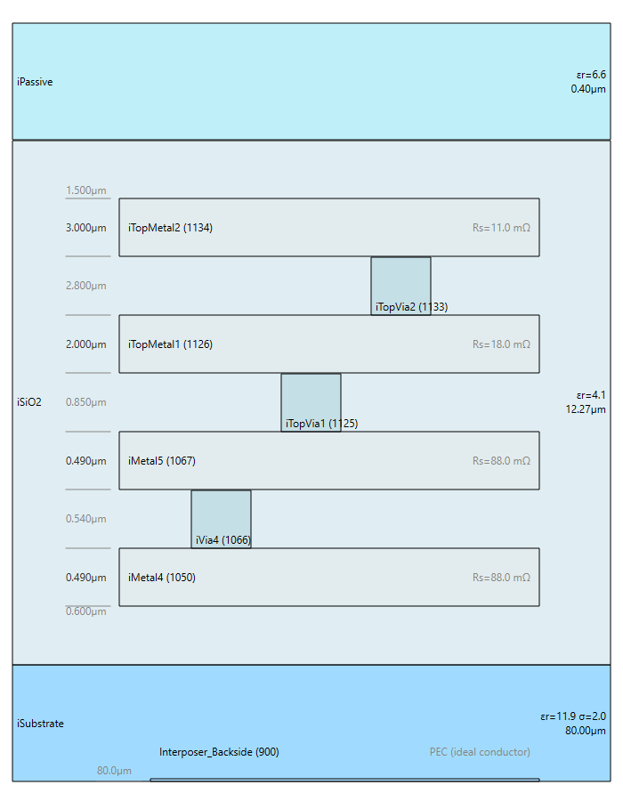
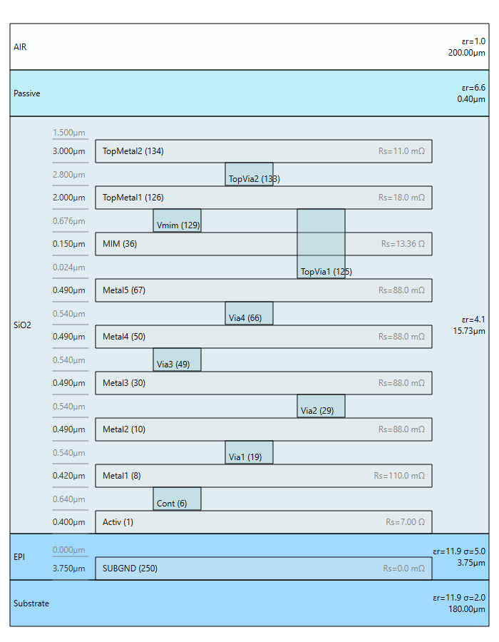
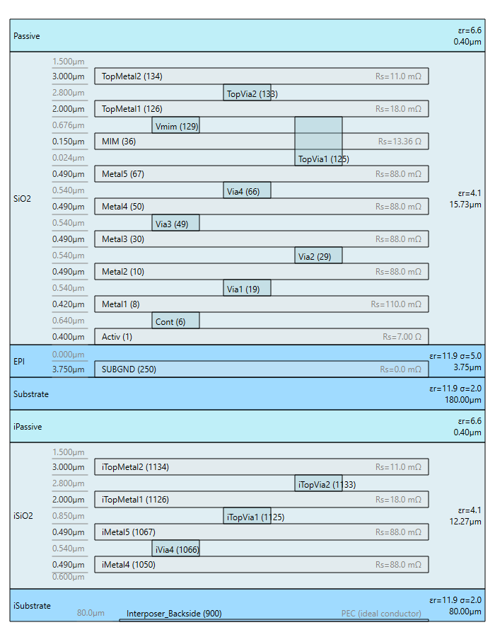
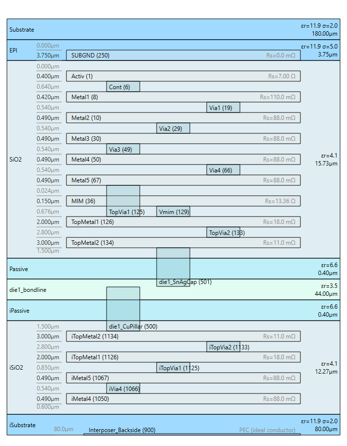
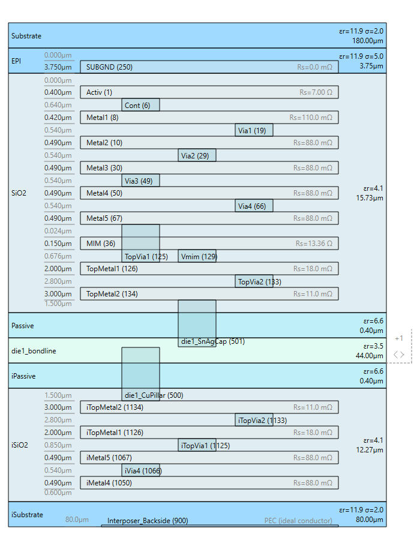
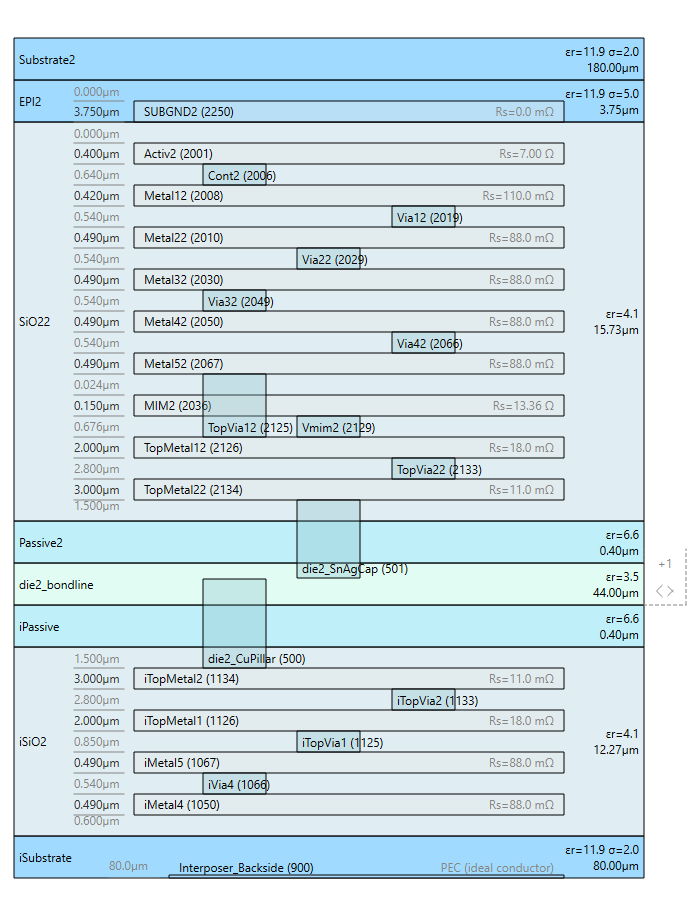
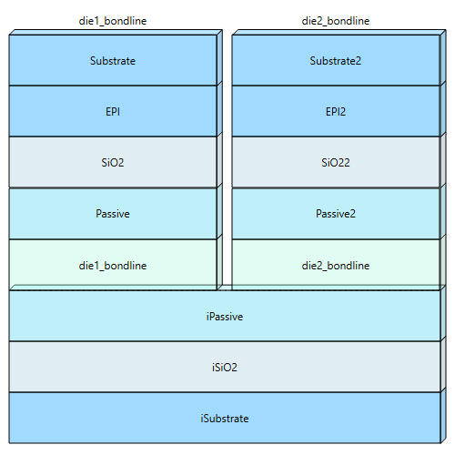

# Usage guide

`chiplet_xml_composer` stitches several per-chiplet gds2palace stackup XML files into one
combined stackup XML. An IHP [`.chiplet`](https://github.com/IHP-GmbH/chiplet-spec) assembly
file drives the merge.

The combined XML is an ordinary [gds2palace](https://github.com/VolkerMuehlhaus/gds2palace_ihp_sg13g2)/openEMS
stackup file. You can open it in setupEM's Stackup Editor. You can feed it to `gds2palace` or
`gds2openEMS` directly. You can also just inspect it with a text editor.

**Scope (v1):** Z-stack merge only. The tool produces one combined stackup XML.

It never touches GDSII geometry. It does not:

- Read GDSII geometry
- Place GDSII geometry
- Rotate GDSII geometry
- Mirror GDSII geometry

See [`CHIPLET_FORMAT.md`](CHIPLET_FORMAT.md) for the exact list of `.chiplet` fields this tool
reads and ignores. See [`HOW_IT_WORKS.md`](HOW_IT_WORKS.md) for the merge algorithm.

This guide has two parts. The first is for human readers. It uses narrative text and worked
examples. The second is for AI agents. It is a compact, structured reference for building a
correct invocation programmatically.

Both parts describe the same tool. Read whichever part fits how you are using it. You can also
read both.

---

## For human readers

### Install

Run this from the repo root:

```bash
pip install -e .
```

This installs the `chiplet_xml_composer` console script. It also installs two dependencies:
`gds2palace` and `chiplet-format-io`.

`chiplet-format-io` reads `.chiplet` YAML files. It is not on PyPI yet. It installs from a
pinned commit of [IHP-GmbH/chiplet-spec](https://github.com/IHP-GmbH/chiplet-spec) instead. See
`pyproject.toml` for the exact commit.

### Command-line reference

```
chiplet_xml_composer --chiplet-file FILE --stackup TECH=PATH [--stackup TECH=PATH ...]
                      --attach COMPONENT_ID=DIELECTRIC [--attach COMPONENT_ID=DIELECTRIC ...]
                      [--interconnect-methods FILE]
                      [--connection-materials FILE]
                      [--boundary-layer COMPONENT_ID=GDSLAYER ...]
                      [--bondline-material NAME]
                      -o OUTPUT.xml
```

| Flag | Required | Repeatable | Meaning |
|---|---|---|---|
| `--chiplet-file` | yes | no | Path to the `.chiplet` assembly YAML file. |
| `--stackup` | yes, one per technology used | yes | `TECH=PATH`. Maps a `.chiplet` `technology:` id to your own gds2palace stackup XML file. This tool never reads the `.chiplet` file's own `technology.stackup` field. That field uses a different YAML schema. See [`CHIPLET_FORMAT.md`](CHIPLET_FORMAT.md). |
| `--attach` | yes, one per die component | yes | `COMPONENT_ID=DIELECTRIC`. Names the Dielectric in the interposer's own stackup XML that this die attaches to. Example: `die1=iPassive`. |
| `--interconnect-methods` | only if any component declares `connection:` | no | Path to an `interconnect_methods.json` registry. Required whenever a die has a `connection:`. The `.chiplet` file alone never gives a GDS layer number for a bump or pillar layer. See [`CHIPLET_FORMAT.md`](CHIPLET_FORMAT.md). |
| `--connection-materials` | only if any component declares `connection:` | no | Path to a `--connection-materials` sidecar JSON file. Required under the same condition as `--interconnect-methods`. Supplies electrical/thermal properties for every `connection_stack` layer's material and for `--bondline-material`. Neither the `.chiplet` file nor `interconnect_methods.json` carries these properties. See [`CHIPLET_FORMAT.md`](CHIPLET_FORMAT.md). |
| `--boundary-layer` | only for a die that gets a bridging Dielectric | yes | `COMPONENT_ID=GDSLAYER`. Sets the GDS layer number for that die's bridging Dielectric, also called the bondline. Its `Boundary=` attribute uses this number. Needed whenever `connection:` resolves to a nonzero total height. That means a real bump/pillar stack, not a direct bond. |
| `--bondline-material` | no | no | Material name for every bridging Dielectric this run creates. Default `"Underfill"`. Looked up in `--connection-materials`. See [Error messages](#error-messages-you-might-see). |
| `-o`, `--output` | yes | no | Path to write the combined stackup XML to. |

`--stackup`, `--attach`, and `--boundary-layer` are all repeatable `KEY=VALUE` flags. Pass one
per technology or component. Order does not matter.

### Worked examples

All three examples use the same two real stackups, shipped in [`test_data/`](../test_data/):

- `interposer_IntM4TM2.xml` - a real IHP interposer technology (IntM4TM2).
- `SG13G2_die.xml` - a real IHP SG13G2 die stackup.

Each example also ships its own `.chiplet` input file and its own already-generated `combined.xml`
output, under [`examples/`](../examples/). Open the output file directly to see exactly what the
tool produced, or regenerate it yourself with the command shown.

Every example below also ships a stackup cross-section preview PNG, so you can see the result
without opening the XML yourself. These are rendered by
[`tools/render_stackup_preview.py`](../tools/render_stackup_preview.py), reusing setupEM's own
interactive "Stackup Preview" window's layout/paint engine
(`setupEM.setup_common.compute_stackup_layout`/`render_stackup_layout`) headlessly - the exact
same picture you'd see opening the file in setupEM's Stackup Editor. That script is a doc-generation
tool, not part of the installed `chiplet_xml_composer` package - the package itself never depends
on setupEM or PySide6.

Both input stackups look like this on their own, before any merge:

| `interposer_IntM4TM2.xml` | `SG13G2_die.xml` |
|---|---|
|  |  |

#### 1. Minimal: a die bonded directly to the interposer, no bump/pillar stack

This is the simplest case. The die has no `orientation:`, so it defaults to `face_up`. The die
also has no `connection:`. Its stack attaches directly to the interposer's Dielectric. No
bridging layer is created.

[`examples/01_direct_bond/assembly.chiplet`](../examples/01_direct_bond/assembly.chiplet):

```yaml
format_version: "1.0"

assembly:
  name: "SG13G2 die, direct bond, no bump/pillar stack"

technologies:
  intm4tm2:
    description: "IHP IntM4TM2 silicon interposer"
  sg13g2:
    description: "IHP SG13G2 die"

components:
  - id: "interposer"
    type: "interposer"
    technology: "intm4tm2"

  - id: "die1"
    type: "die"
    technology: "sg13g2"
```

```bash
chiplet_xml_composer \
    --chiplet-file examples/01_direct_bond/assembly.chiplet \
    --stackup intm4tm2=test_data/interposer_IntM4TM2.xml \
    --stackup sg13g2=test_data/SG13G2_die.xml \
    --attach die1=iPassive \
    -o examples/01_direct_bond/combined.xml
```

Output:

```
chiplet_xml_composer 1.0.0
  ...
wrote examples/01_direct_bond/combined.xml
  detected 0 chiplet(s): []
  no z-overlaps, no missing chiplet boundaries
```

This printed summary comes from the tool's own built-in verification step. See
[`HOW_IT_WORKS.md`](HOW_IT_WORKS.md#built-in-post-write-verification) for details.

Zero chiplets is the correct result here, not a bug. `iPassive` gets exactly one new referrer:
the die's own Dielectric chain, attached directly. A "chiplet," in the sense this tool's
detection algorithm uses, only exists once some Dielectric has *two or more* referrers. See
[`HOW_IT_WORKS.md`](HOW_IT_WORKS.md#chiplet-detection-branch-points-not-just-attachments) for
more.

Open [`examples/01_direct_bond/combined.xml`](../examples/01_direct_bond/combined.xml) to see the
result. The die's own dielectrics (`Substrate`, `EPI`, `SiO2`, `Passive`) now sit stacked directly
on top of `iPassive`, bottom to top, in their original order - `Substrate`, the die's own bulk
silicon, ends up right against the interposer, since nothing flipped it.



#### 2. Flip-chip die with a Cu-pillar connection stack

This example mounts the die face-down, using `orientation: flip_chip`. The die bonds through a
real two-layer bump stack, using `connection: cupillar_opt1`. This setup needs
`--interconnect-methods`, `--connection-materials`, and `--boundary-layer`, in addition to
`--attach`.

[`examples/02_flip_chip_cupillar/assembly.chiplet`](../examples/02_flip_chip_cupillar/assembly.chiplet):

```yaml
format_version: "1.0"

assembly:
  name: "SG13G2 die, flip-chip mounted via Cu-pillar bumps"

technologies:
  intm4tm2:
    description: "IHP IntM4TM2 silicon interposer"
  sg13g2:
    description: "IHP SG13G2 die"

components:
  - id: "interposer"
    type: "interposer"
    technology: "intm4tm2"

  - id: "die1"
    type: "die"
    technology: "sg13g2"
    orientation: "flip_chip"
    connection: "cupillar_opt1"
```

`test_data/interconnect_methods.json` defines `cupillar_opt1`. It mirrors a real IHP SG13G2
Cu-pillar option: a 28 um Cu pillar plus a 16 um SnAg solder cap, 44 um total. This file stays
close to the shape of IHP's own real `interconnect_methods.json` - it only ever *names* a
material (`"material": "CuPillar"`), it never gives one electrical properties:

```json
{
  "layer_registry": {
    "CuPillar": {"gds_layer": 500, "gds_datatype": 35, "material": "CuPillar"},
    "SnAgCap": {"gds_layer": 501, "gds_datatype": 35, "material": "SnAgSolder"}
  },
  "methods": {
    "cupillar_opt1": {
      "connection_stack": {
        "layers": [
          {"name": "CuPillar", "material": "CuPillar", "height": 28.0, "diameter": 44.0},
          {"name": "SnAgCap", "material": "SnAgSolder", "height": 16.0, "diameter": 44.0}
        ]
      }
    }
  }
}
```

Electrical properties for `CuPillar`, `SnAgSolder`, and the bondline's own `Underfill` material
come from a second file, `test_data/connection_materials.json`. This file has no counterpart in
the real `.chiplet`/`interconnect_methods.json` ecosystem - it exists only because
`chiplet_xml_composer` refuses to invent a material property, and neither of the other two files
carries one. Every value in it is sourced, not guessed - see the `"source"` field on each entry:

```json
{
  "materials": {
    "CuPillar": {
      "type": "Conductor",
      "conductivity": 59600000.0,
      "source": "Bulk copper conductivity (1.68 uOhm*cm) - a standard physical reference value."
    },
    "SnAgSolder": {
      "type": "Conductor",
      "conductivity": 7400000.0,
      "source": "Published SAC305 solder resistivity, 13.0-14.5 uOhm*cm."
    },
    "Underfill": {
      "type": "Dielectric",
      "permittivity": 3.5,
      "dielectric_loss_tangent": 0.018,
      "source": "Typical epoxy flip-chip underfill: dielectric constant ~3.5-3.8, loss tangent ~0.018-0.02."
    }
  }
}
```

```bash
chiplet_xml_composer \
    --chiplet-file examples/02_flip_chip_cupillar/assembly.chiplet \
    --stackup intm4tm2=test_data/interposer_IntM4TM2.xml \
    --stackup sg13g2=test_data/SG13G2_die.xml \
    --attach die1=iPassive \
    --interconnect-methods test_data/interconnect_methods.json \
    --connection-materials test_data/connection_materials.json \
    --boundary-layer die1=2000 \
    -o examples/02_flip_chip_cupillar/combined.xml
```

```
chiplet_xml_composer 1.0.0
  ...
wrote examples/02_flip_chip_cupillar/combined.xml
  detected 0 chiplet(s): []
  no z-overlaps, no missing chiplet boundaries
```

Zero chiplets, same reason as example 1: only one die attaches to `iPassive`, so it never becomes
a branch point. See example 3 for a case that does detect chiplets.

Open [`examples/02_flip_chip_cupillar/combined.xml`](../examples/02_flip_chip_cupillar/combined.xml)
to see the result. Bottom to top, right above the interposer's own `iPassive`, you'll find:

- `die1_bondline`, a new 44 um `Underfill` Dielectric, carrying `Boundary="2000"` from
  `--boundary-layer`. This is the interconnect stack's total height: 28 + 16 um.
- `die1_CuPillar` and `die1_SnAgCap`, two new `<Layer Type="VIA">` elements, on GDS layers 500
  and 501. Their combined z-range is *wider* than `die1_bondline`'s own 44 um: `die1_CuPillar`'s
  own `Zmin` reaches 1.9 um below the bondline's own bottom edge, down to `iTopMetal2`'s own top
  surface, and `die1_SnAgCap`'s own `Zmax` reaches 1.9 um above the bondline's own top edge, up to
  `TopMetal2`'s own bottom surface (once flipped). A bump's declared height is a pad-to-pad
  measurement, not a dielectric-surface-to-dielectric-surface one - see
  [`HOW_IT_WORKS.md`](HOW_IT_WORKS.md#connection-stack-pad-to-pad-anchoring) for why, and open the
  picture below to see the via visibly crossing into `iSiO2` below and `SiO2` above.
- In `<Materials>`, one new `Underfill`, `CuPillar`, and `SnAgSolder` entry each - synthesized
  from `connection_materials.json`, with the properties shown above. Neither
  `interposer_IntM4TM2.xml` nor `SG13G2_die.xml` defines any of these three.
- The die's own dielectrics, reversed: `Passive` now sits right on top of the bondline, since it
  was the die's own outermost Dielectric next to the stripped `AIR`. `SiO2`, `EPI`, and
  `Substrate` follow, in that order - `Substrate`, the bulk silicon, now ends up farthest from
  the interposer, exactly as a real flipped die would sit.



Compare this to `SG13G2_die.xml`'s own cross section, above: `Substrate` was at the bottom there,
right after the stripped `AIR`; here it's at the top, farthest from the interposer. That's
`orientation: flip_chip`'s z-reversal, visible directly in the picture.

#### 3. Two dies of the same technology on one interposer

A second die needs nothing extra beyond another `--attach`/`--boundary-layer` pair.
`chiplet_xml_composer` auto-detects and resolves every name and GDS-layer-number collision
between chiplets, not just against the interposer.

[`examples/03_two_dies/assembly.chiplet`](../examples/03_two_dies/assembly.chiplet) adds a second
`sg13g2` die, `die2`, identical to `die1`:

```yaml
components:
  - id: "interposer"
    type: "interposer"
    technology: "intm4tm2"
  - id: "die1"
    type: "die"
    technology: "sg13g2"
    orientation: "flip_chip"
    connection: "cupillar_opt1"
  - id: "die2"
    type: "die"
    technology: "sg13g2"
    orientation: "flip_chip"
    connection: "cupillar_opt1"
```

```bash
chiplet_xml_composer \
    --chiplet-file examples/03_two_dies/assembly.chiplet \
    --stackup intm4tm2=test_data/interposer_IntM4TM2.xml \
    --stackup sg13g2=test_data/SG13G2_die.xml \
    --attach die1=iPassive --attach die2=iPassive \
    --interconnect-methods test_data/interconnect_methods.json \
    --connection-materials test_data/connection_materials.json \
    --boundary-layer die1=2000 --boundary-layer die2=2100 \
    -o examples/03_two_dies/combined.xml
```

```
chiplet_xml_composer 1.0.0
  ...
wrote examples/03_two_dies/combined.xml
  detected 2 chiplet(s): ['die1_bondline', 'die2_bondline']
  no z-overlaps, no missing chiplet boundaries
```

This time `iPassive` gets two referrers, `die1_bondline` and `die2_bondline`, so it becomes a
branch point and both dies show up as detected chiplets.

Open [`examples/03_two_dies/combined.xml`](../examples/03_two_dies/combined.xml) to see the
result. Both dies use the identical `SG13G2_die.xml` source file. Left alone, their Dielectric,
Material, and Layer names (`Passive`, `Substrate`, `Cont`, and others) would collide. Their
native GDS layer numbers would collide too.

`chiplet_xml_composer` renames `die2`'s copies instead: `die1` keeps the original names
(`Passive`, `SiO2`, `EPI`, `Substrate`, ...), and `die2` gets `Passive2`, `SiO22`, `EPI2`,
`Substrate2`, and so on. It also shifts `die2`'s native GDS layer numbers into a fresh range,
clear of both the interposer's and `die1`'s - `die1`'s own numbers need no shift at all here,
since nothing in the interposer collides with them, but `die2`'s do, landing at `+2000` (not
`+1000`: that would have put `die2`'s own `Metal4` at GDS layer `1050`, which collides with the
interposer's own `iMetal4`).

Two numbers are the exception: the Cu-pillar bump's own GDS layers, `500` and `501`. Both dies
correctly share them. They are fixed, PDK-wide registry numbers from `interconnect_methods.json`,
not technology-arbitrary ones. See
[`HOW_IT_WORKS.md`](HOW_IT_WORKS.md#namegds-layer-collision-avoidance) for why they don't need
disambiguating.

The `CuPillar`, `SnAgSolder`, and `Underfill` `<Material>` entries are shared the same way -
`chiplet_xml_composer` adds each one once, the first time either die needs it, and reuses it for
the second die rather than creating a renamed duplicate. Open the combined file and confirm it
for yourself: exactly one `<Material Name="CuPillar">`, not two.

A stackup cross-section preview can only show one traversal through the Reference chain at a
time, so a stackup with 2+ detected chiplets gets two kinds of preview instead of one: one cross
section per chiplet (interposer plus that one die's own branch), and a separate "topology
overview" sketch showing every chiplet side by side on the shared interposer base (not to scale -
see [`HOW_IT_WORKS.md`](HOW_IT_WORKS.md#chiplet-detection-branch-points-not-just-attachments)).

`die1`'s own branch:



`die2`'s own branch - notice the renamed Dielectric/Layer/Material names (`Passive2`, `Metal12`,
...) and the shifted GDS layer numbers, but the *same* `CuPillar`/`SnAgSolder` bump layers on the
*same* GDS layers 500/501 as `die1`:



Topology overview, both dies side by side on the shared interposer:



### Python API

```python
from chiplet_xml_composer import compose, ComposeError

try:
    tree = compose(
        chiplet_path="assembly.chiplet",
        stackup_map={"intm4tm2": "interposer_IntM4TM2.xml", "sg13g2": "SG13G2_die.xml"},
        attach_map={"die1": "iPassive"},
        interconnect_methods_path="interconnect_methods.json",   # only if any connection: is used
        connection_materials_path="connection_materials.json",   # required under the same condition
        boundary_layer_map={"die1": 2000},                       # only for dies with a bondline
        bondline_material="Underfill",                            # optional, this is the default
    )
except ComposeError as e:
    print(f"could not compose: {e}")
else:
    import xml.etree.ElementTree as ET
    ET.indent(tree, space="  ")
    tree.write("combined.xml", encoding="UTF-8", xml_declaration=True)
```

`compose()` returns an `xml.etree.ElementTree.ElementTree`. Nothing is written to disk until you
call `.write()` yourself. The CLI does exactly this, plus the verification step described next.

### Error messages you might see

Every hard error raises `ComposeError`. From the CLI, this prints `ERROR: <message>` and exits
with status 1. Each message names exactly what's missing:

- `"Component "X" uses technology "Y", which has no --stackup mapping"` - add
  `--stackup Y=path/to/stackup.xml`.
- `"Component "X" has no --attach mapping"` - add `--attach X=<dielectric-name>`. Name a real
  `<Dielectric Name="...">` in the interposer's own stackup XML.
- `"At least one component declares connection:, but no --interconnect-methods was given"` -
  add `--interconnect-methods path/to/interconnect_methods.json`.
- `"At least one component declares connection:, but no --connection-materials was given"` -
  add `--connection-materials path/to/connection_materials.json`. See
  [`CHIPLET_FORMAT.md`](CHIPLET_FORMAT.md) for the file's shape and why it's separate from
  `interconnect_methods.json`.
- `"connection: "X" is not a known method in this interconnect_methods.json"` - check the
  `methods` map in your `interconnect_methods.json`. Confirm the exact id spelling.
- `"connection_stack layer "X" ... has no entry in this interconnect_methods.json's
  layer_registry"` - every layer name a method's `connection_stack.layers[]` uses must also
  appear in the top-level `layer_registry` map, with a `gds_layer` number.
- `"Component "X" needs a bridging Dielectric ... but has no --boundary-layer mapping"` - add
  `--boundary-layer X=<gds-layer-number>`. This is only required when the resolved
  `connection_stack` has nonzero total height. A direct, zero-height bond needs no bondline and
  no boundary layer.
- `"Component "X"'s --attach target "Y" is not a Dielectric in the interposer's own stackup"` -
  a connection stack anchors to the interposer's own topmost metal, which means it needs
  `--attach`'s own target to be a real `<Dielectric Name="Y">` there - not a typo, and not a
  Layer name. See [`HOW_IT_WORKS.md`](HOW_IT_WORKS.md#connection-stack-pad-to-pad-anchoring).
- `"... has no non-sheet metal Layer for a connection_stack to anchor to"` - a connection stack
  needs a real conductor `<Layer>` (not a `Type="sheet"` one) somewhere in the interposer's own
  stackup, and a real conductor `<Layer>` somewhere in this die's own stackup, to anchor its two
  outer ends to. Add one, or don't use `connection:` for a component whose stackup has none.
- `"Material "X" ... has no entry in this --connection-materials file's "materials" map"` -
  `chiplet_xml_composer` never invents electrical or thermal material properties. Add a
  `"X": {"type": "Conductor", "conductivity": ...}` (or `"Dielectric"`/`"permittivity"`) entry
  to your `--connection-materials` file's `"materials"` map.
- `"Material "X" ... collides with a Material of the same name already defined in an input
  stackup XML"` - a `--stackup` input file already defines a `<Material Name="X">` of its own.
  Rename one of them - either the entry in `--connection-materials`, or the one in the stackup
  XML.
- `"Component "X" is orientation: flip_chip, but its stackup has no outer AIR dielectric"` -
  flip-chip mirroring pivots on the surface an outer `AIR` dielectric is stripped from. See
  [`HOW_IT_WORKS.md`](HOW_IT_WORKS.md#flip-chip-z-reversal). Add an `AIR` dielectric to that
  die's own stackup XML. Or drop `orientation: flip_chip` if the die really does mount face-up.
- `"Expected exactly one component with type: interposer, found N"` - v1 supports exactly one
  shared interposer per assembly. See
  [`CHIPLET_FORMAT.md`](CHIPLET_FORMAT.md#not-read-out-of-scope-for-v1).

---

## For AI agents

This section is a compact reference for constructing a correct invocation programmatically -
from a `.chiplet` file and its sibling inputs, without a human filling in flags by hand. Read
[`CHIPLET_FORMAT.md`](CHIPLET_FORMAT.md) first if you need to know exactly which `.chiplet`/
`interconnect_methods.json` fields exist; this section assumes that and focuses on the
decision procedure.

### Procedure: constructing an invocation from a `.chiplet` file

1. **Parse `components[]`.** Exactly one entry must have `type: interposer` - if zero or more
   than one, this tool cannot handle the file (v1 limitation, not a fixable flag combination).
   Every entry with `type: die` or `type: die_array` needs the steps below; `type: substrate`
   entries are silently ignored (out of scope for v1, not an error).
2. **For every distinct `technology:` value** across the interposer and every die component,
   you need a stackup XML file path to pass as `--stackup TECH=PATH`. This is **not** the
   `.chiplet` file's own `technologies.<id>.stackup` field (a different YAML schema this tool
   never reads) - it must come from elsewhere: a mapping the caller already has, a convention
   (e.g. a file named `<technology>.xml` in a known directory), or a question back to whoever
   supplied the `.chiplet` file if no mapping is available. **Do not guess a path that doesn't
   exist** - `compose()` raises `ComposeError` naming the missing technology id, which is a
   clean, catchable signal that this mapping is the missing piece.
3. **For every die component, determine its attachment Dielectric** - `--attach COMPONENT_ID=NAME`,
   where `NAME` must be a real `<Dielectric Name="...">` in the interposer's own stackup XML.
   The `.chiplet` file itself does not name this (v1 has no XY placement to derive it from) - it
   must come from the same source as the stackup mapping (caller-supplied, or ask).
4. **Check every die component's `connection:` field.**
   - Absent or empty: no `--interconnect-methods`/`--connection-materials`/`--boundary-layer`
     needed for that die - it bonds directly to its `--attach` target.
   - Present: you need an `interconnect_methods.json` file path (`--interconnect-methods`,
     passed once, shared across all dies) whose `methods` map contains that `connection:` id,
     and whose `layer_registry` map has an entry (with `gds_layer`) for every name in that
     method's `connection_stack.layers[]`. You also need a `--connection-materials` sidecar
     path (see step 6) under the same condition. If the resolved `connection_stack` has nonzero
     total height, that die also needs `--boundary-layer COMPONENT_ID=<gds-layer-number>` - a
     value that must come from the caller (nothing in either input file names it; see
     [`CHIPLET_FORMAT.md`](CHIPLET_FORMAT.md#not-read-missing-information) for why). A nonzero
     total height also needs a real, non-`Type="sheet"` conductor `<Layer>` somewhere in the
     interposer's own stackup, and another in this die's own stackup - the connection stack
     anchors its two outer ends to the real pad metal on each side, not to a Dielectric edge.
     See [`HOW_IT_WORKS.md`](HOW_IT_WORKS.md#connection-stack-pad-to-pad-anchoring).
5. **Check `orientation:`** on each die. `flip_chip` requires that die's own stackup XML to have
   an outer `AIR` Dielectric (topmost or bottommost by resolved z) - if you can, verify this by
   reading the die's stackup XML directly (look for a `<Dielectric ... Material="AIR" />` or one
   resolving to the built-in AIR material) before invoking, since the tool's own error message
   for this case is a hard failure, not a fallback. Any other value (or absent) needs nothing
   extra.
6. **Every Material a `connection_stack` layer names, and `--bondline-material` (default
   `"Underfill"`), must have an entry in the `--connection-materials` sidecar's `"materials"`
   map - never in a `--stackup` input file.** These materials are not physically part of either
   piece being joined, so `chiplet_xml_composer` never looks for them there; it only accepts
   them from `--connection-materials`, and refuses to run rather than invent a property. If
   you're generating or selecting a `--connection-materials` file yourself and one of these
   materials is missing, add a `"name": {"type": "Conductor", "conductivity": ...}` (or
   `"Dielectric"`/`"permittivity"`) entry to its `"materials"` map. A same-named `<Material>`
   already present in a `--stackup` file is treated as a collision, not a fallback source - see
   [`CHIPLET_FORMAT.md`](CHIPLET_FORMAT.md) for why this file is kept separate from
   `interconnect_methods.json`.
7. **Compose the command** (or call `compose()` directly - identical semantics, see the Python
   API in the human section above) with one `--stackup`/`--attach` per technology/die and one
   `--interconnect-methods`/`--connection-materials`/`--boundary-layer` set only where step 4
   required it.

### Flag grammar (compact)

```
--chiplet-file <path>                          (exactly one)
--stackup <technology_id>=<path>               (one per distinct technology used)
--attach <component_id>=<dielectric_name>      (one per die/die_array component)
--interconnect-methods <path>                  (zero or one; required iff any connection: is used)
--connection-materials <path>                  (zero or one; required iff any connection: is used)
--boundary-layer <component_id>=<gds_layer>    (one per die whose connection_stack has nonzero height)
--bondline-material <name>                     (zero or one; default "Underfill")
-o <path>                                       (exactly one)
```

All `KEY=VALUE` flags split on the first `=` only; a component id or technology id containing
`=` is not supported.

### Machine-checkable outcome

- **Exit code 0** = success. Stdout's last lines are always:
  `  detected N chiplet(s): [...]` then either `  no z-overlaps, no missing chiplet boundaries`
  or one or more `  WARNING: <text>` lines (non-fatal - the file was still written; treat these
  as findings to surface, not as a failure).
- **Exit code 1** = failure. Stdout contains exactly one `ERROR: <message>` line; no output file
  is written. Every message is a complete, self-contained description of the one missing/wrong
  input (see the human section's [error list](#error-messages-you-might-see) for the exact
  strings) - parse it for the missing key (technology id, component id, material name, method
  id) rather than pattern-matching the whole sentence, since wording may be refined over time.
- Calling `compose()` directly (Python API) raises `chiplet_xml_composer.ComposeError` with the
  same message instead of printing/exiting - prefer this over shelling out when already in
  Python, since it's a normal catchable exception.
- **No side effects on failure or on the inputs**: `compose()` never writes anything itself
  (the caller's own `.write()` call is the only place output is produced) and never mutates the
  `.chiplet`/stackup/`interconnect_methods.json` files it reads. Re-running with corrected flags
  after a `ComposeError` is always safe.
